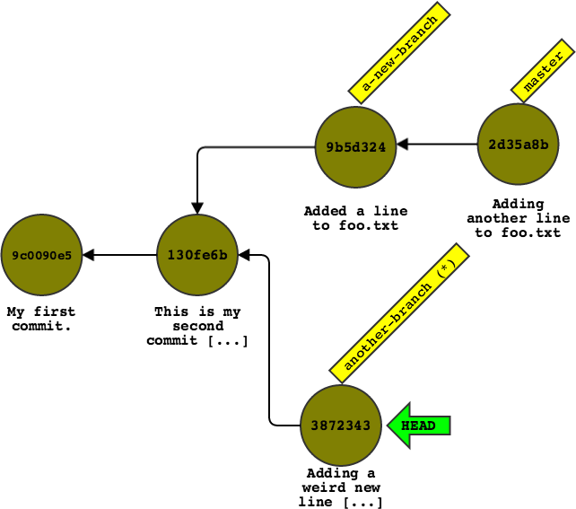

# What Git is and how to think about it (and use it)

By Leonid Grinberg

## What is Git?

Git is a type of software known as a _version control system_. As the name implies, a version control system is a program that keeps track of versions of your files. In this context, a _version_ is just a particular state of a file (or collection of files). Any change you make could be called a new version. A version control system (or VCS) helps you declare, name, and generally manage your files and their different versions.

In principle, any type of file or collections of files can be managed by a VCS. The largest category of people that tend to use a VCS, however, are software developers. This is because software developers tend to work in groups on very large collections of files, and even small changes can have huge consequences on how the software works. Additionally, most VCS programs (including Git) have functionality for sharing files and their different versions, which is particularly useful for software developers.

That said, there is nothing really special about code. Code is (usually) just text, and a VCS that can manage code well can probably manage any other kind of text well, too. So if you have heard of Git but are not a programmer, don't despair! Git can be useful for you too. For example, if you tend to write essays, notes, or any other kind of text, Git might be the tool for you.

Just one caveat: For various reasons, Git is **not** good at working with binary files. Binary files are any files that are not just plain text (e.g. you couldn't open them in TextEdit on OS X or Notepad on Windows). Microsoft Word files, for example, while "text files," also contain lots of formatting and other data that don't make them suitable for Git. You'll need to be working with plain text. That said, there are many VCS-like features in those programs too; think about "Track Changes" in Microsoft Word.


## About this document

Git is a unique piece of software. With breathtaking speed, it has found itself to be **the** standard for code sharing and version control, both in industry and open source communities. Several companies have staked massive fortunes on it: [GitHub](https://github.com), for instance, now uses it to host much of the systems and frameworks that collectively make up the modern web, not to mention an increasingly large amount of proprietary company code.

And yet, despite being so widely used, there's a surprising dearth of good documentation about **how** to use it. Most existing documentation falls into one of two categories. Some pieces, like the [GitHub bootcamp](https://help.github.com/categories/bootcamp/) are essentially quick-and-dirty "tutorials": their goal is to teach users how to accomplish a particular task with Git by listing out a few commands and not really explaining what those commands are doing. This works for a little while, but the problem is that Git, while a very powerful tool, has a **horrible** UI. As a result, it's just a matter of time before users make a mistake and find themselves in a state the tutorial doesn't cover.

The other type of documentation suffers from the opposite problem: it goes into **too much** detail. The best example of this is the ["Git Internals" chapter of the Git Book](http://git-scm.com/book/en/v2/Git-Internals-Plumbing-and-Porcelain). It explains in meticulous detail how Git works under the hood. By the end of it, you're either bored or fascinated, but you've certainly forgotten what task you were trying to accomplish in the first place.

Both of these approaches suffer from the same fundamental problem: they don't capitalize on the fact that Git is not just a powerful tool, but an elegant one. While its UI is indeed horrible, the principles behind the tool are remarkably clean and simple. They are concepts that are embodied by the UI (such as it is) and are generic enough to accomplish any task. At the same time, it is **not** necessary to understand the program's internals to learn how ot use Git (in fact, doing so can undermine the learning process). If you can get past the clunky UI to the underlying principles it is trying to expose, you can learn to use Git well.

This document aims to teach how to use Git using those principles.

### Prerequisites

You do **not** have to have tried using Git before to read this document. You also do not need to be a programmer, or even want to use Git for code. As explained in the first section, Git is fundamentally just a tool for manipulating text, and you can use it to keep track of any kind of plain text. (However, it's not good for binary data.)

That said, this document does have some prerequisites. The most important one is that you need to be comfortable using the Unix command line. This doesn't mean you need to be a pro, or even an advanced user. It just means you should understand what "running commands" mean and can understand Unix-y shortcuts like "`~`" (e.g. "`~/.gitconfig`"), as well as the concept of "hidden files" (i.e. files that begin with a `.` that `ls` won't show you but `ls -a` will). While there are some [visual](https://mac.github.com/) [programs](https://www.sourcetreeapp.com/) that technically make it possible to use Git while avoidings the command line, I think it is worth learning the commands before switching to the GUI-only approach. The programs are getting quite good, but they nonetheless bring their own interpretations and concepts to the table that I believe will end up being confusing—at least while you're learning.

**Note for Windows users:** If you're on Windows, the Git installation will usually come with a small version of the Unix command line (often called "Git Bash" or similar). You can use it to run all of these same commands. Do **not** use Command Prompt.

Another prerequisite is that you should be comfortable using some plain-text editor that you can call from the command-line. It doesn't really matter what this editor is: it can be [nano](http://www.nano-editor.org) or [vim](http://www.vim.org/) or [emacs](http://www.gnu.org/software/emacs/). It can even be [TextEdit or Notepad](http://nicercode.github.io/git/setup.html) (scroll down to the [note about setting your editor](#editor) in the "Getting started" section).

Finally, a prerequisite for using this document is having [downloaded and installed Git](https://git-scm.com/downloads). If you can run "`git`" in a terminal and see a list of commands that Git understands, you're good.


### Formatting and syntax used in this document

To make reading this document as easy as possible, I try to be consistent in how I format certain things and what syntax I use. Here's a quick summary:

* General "computery" things are written in `monospace font`. This includes things like commands, file names, the contents of files, and so on.

* Anything indented in monospace that begins with a `$` sign is a command you should enter. For example:

  ```
  $ git version
  git version 2.3.2 (Apple Git-55)
  ```

  You should **not** enter the `$` sign when entering the command. It is only there to signify that this is a command (many Unix shells have their prompts end with the `$` sign, which is why it's there).

* Definitions are written in _intalicized_ font.

* Emphasized words are written in **bold** font.

* The word "Git" (capitalized in normal font) refers to the program itself.

* The word `git` (lowercase and in monospace) refers specifically to the command.


### How to use this document

Everyone learns differently. That said, my suggestion is to just read through this document once **replicating the commands run in the document**. Don't worry too much about bookmarking or writing down the specific commands that you run. Just running them and seeing the results is probably the best way to get a sense of what is happening.

The appendix at the end of this document lists the commands we've covered, what their syntax is, and when the command was first introduced. You can use this appendix as a starting point once you start using Git for your own projects and want to refer back to something.

## Getting started

### Configuring Git

(Those of you who have tried to use Git before may have already done the things described in this section. If so, you can just skim or skip ahead altogether.)

As with many programs, one of the first things that you should do with Git after installing it is configuring it. There are a few things you should do:

1. <span id="editor">**Set the editor Git will use:**</span> There are a few times that Git will want to open a text editor for you to do something. You should tell it which editor to use (if you don't, it will resort to the `$EDITOR` environment variable). If, for example, you want to use Nano, you should run something like this:

  ```
  $ git config --global core.editor nano
  ```
        
  After you run this command, take a look at the file `~/.gitconfig`. It should now contain something like this:
  
  ```
  [core]
          editor = nano
  ```
  
  This command is a good example of a typical Git command. The main _command_ you're running is `git` followed by some _subcommand_ (in this case `config`). The subcommand is basically like its own program: it has its own set of options and arguments that it expects. Sadly, the options, arguments, and sometimes even syntax of the different subcommands is not consistent, which is why I say Git has a horrible UI.
  
  **All** that this command does is write to the file `~/.gitconfig`. This file is the global configuration file for Git, which is why we included the `--global` option (we'll talk later about what happens if you don't include that option and why you might want to.) There is nothing particularly magical about this command: you could also just as easily write that same contents to the file yourself. But it's nice because the file obviously has a particular format it expects to be written in, and the command does that for you.
  
2. **Tell Git to use colors:** This is simple and helpful. Most newer versions of Git come with this enabled by default, but it's still worth explicitly configuring:

  ```
  $ git config --global color.ui auto
  ```
      
  Once again, take a look at `~/.gitconfig`. It should now have something like this:
  
  ```  
  [color]
          ui = auto
  ```
                
  As you can see, the first part of the argument to the `git config` command (after the `--global`) is the "section" (`core` or `color`) and subsection (`editor` and `ui`), separated by a period. The second is the value (`nano` or `auto`). As you might imagine, there are plenty more sections and subsections. For example, it turns out that the `ui` subsection is really just a catch-all: you can also set the different subsections (`color.branch`, `color.diff`, etc.) individually.
  
  We won't actually get to see the colors in action for a little bit, but trust me, it makes using Git a lot easier.
  
3. 	**Name and email:** You should set your name and email. Again, all this will do is set it in the `~/.gitconfig` file: it won't send them to anyone to spam you. The reason this is worth doing is because Git will use it to save your documents under your identity. When you share anything with others, your identity is preserved.

  ```
  $ git config --global user.name "Jane Doe"
  $ git config --global user.email jane.doe@example.com
  ```

  As you can probably guess, `~/.gitconfig` now includes something like this:
  
  ```
  [user]
          name = Jane Doe
          email = jane.doe@example.com
   ```
   
Before we go on, please note that since all we did is edit `~/.gitconfig`, these decisions can always be changed. If you decide that you prefer a different editor, you can always rerun `git config --global core.editor` or edit the file by hand. Same with colors, name, email, and so on.
                
### Your first repository

Once you have configured Git, you should set up something called a "repository." A _repository_ is just a place for Git to store data. It basically corresponds to a "project." Separate projects should probably have separate repositories. In practice, it will just correspond to some directory (i.e. folder) on your computer.

Repositories are totally self-sufficient. They totally contain everything Git needs to work with them. You can move them around on your hard disk, put them on a flash disk, email them to people, and everything will work just as before. The only requirement is that the people you share the repository with have Git installed. Additionally, nothing you added in `~/.gitconfig` will be included (that's why it's the "global" configuration file). As you'll see soon, there is an analogous _local_ (i.e. per-repository) configuration that you can do as well. If you make local configurations, those will get shared with anyone you share the repository with.

To start, we'll create an empty repository. If you already have a project that you would like to start using Git with, I recommend waiting to finish this document before trying. That way, you can try changing, moving, and deleting files, and generally play around without worrying about losing real data.

The only important thing to note is that **Git does not play well with systems that automatically change files underneath it, such as [Dropbox](https://www.dropbox.com/) or networked filesystems in general.** Do **NOT** start or store a repository in those systems. If you are storing projects there, it's best to move them out once you start using them with Git.

First, create an empty folder on your computer. I'll call mine `~/git-practice`, but you can put yours wherever you want and call it whatever you want (again, with the exception that you shouldn't store it in Dropbox or similar systems). Go to this folder in your terminal, and once you're there, run

```
$ git init repo1
```
        
You should see something like this:

```
Initialized empty Git repository in /Users/leonidg/git-practice/repo1.git/
```
        
(except with your name instead of "`leonidg`"). Switch to `repo1`. If you look at all the files (including the hidden ones), you should see this:

```
$ ls -a
.    ..   .git
```

That is, the only file in this directory is a hidden one, called `.git`. It turns out this is actually its own directory, and if you look inside of it you should see something like this:

```
$ ls .git
HEAD        branches    config      description hooks       info        objects     refs
```

This `.git` directory is the place Git stores all of the data it needs to keep track of the state of this repository. Once you get started, you can delete everything else in the repository and Git will have everything it needs to bring it back exactly the way it was (again, there are some caveats to this, but we'll see them later). Conversely, if you delete the repository, all of the Git magic will go away. The directory will be just a normal directory, left in exactly the state it was in right before you deleted `.git`.

One very important thing to emphasize is that Git is **not** a magic tool that somehow runs in the background and keeps track of your files. It is really just a tool for manipulating data in one-off commands. In other words, the `.git` repository is **the only** place that Git keeps track of its state (with the one exception of the "`git config --global`" command, which just manipulates `~/.gitconfig`).

This is a very important principle to understand, because it means that the best way to think about Git is like any other Unix command that manipulates files and directories (e.g. "`cat foo`" or "`find my-directory`" or "`echo "Hello there" > hello.txt`"). Git might be a particularly advanced one, but it doesn't have a concept of "starting up" or "shutting down." All of the state it needs is in this `.git` directory. More generally, Git isn't a program that "runs in the background" like, for example, Dropbox. It doesn't automatically sync anything for you. For example, if you have a repository on Dropbox, nothing you do with Git will modify that until you "push" to it (more on that below).

You pretty much don't need to worry about the contents of this directory (and, given how important it is, it's best not to mess with it for the time being). The only exception is the file `.git/config`, which, as promised, contains the analogous "local configuration" to the global configuration in the `~/.gitconfig` file. If you look inside this file, you will likely see that it already has some configuration options, probably under the `[core]` section. To modify this file, run any of the `git config` commands we ran before, but this time without the `--global` option. They will end up in this file. If you share this repository with anyone, these local configurations will get shared with them, too.

Again, remember that repositories are totally self-sufficient. If you went ahead and created a second repository, say, `~/git-practice/repo2` and ran `git config` (without the `--global`) in there, then `repo2` could have a different configuration from `repo1`. That might be quite useful (e.g. you might want to use different names for different projects). But this also applies to everything else other than configuration. The two repositories can have totally different files and histories from each other. They are totally separate projects.

The last thing to say about repositories is that you should generally avoid nesting them. In other words, don't run `git init` inside of `repo1`. It technically works, but it will be very confusing, and unless you're very precise, Git will behave in unexpected ways. There is an advanced Git feature called a "submodule" that is roughly conceptually equivalent to one Git repository inside of another. We'll get to it near the end.


## How Git thinks about the world

Before we go any further, it is going to be helpful to describe how Git actually thinks about your repository. Again, we won't go into any details as far as how Git works internally. The important thing is the concepts that it exposes.

### Tree objects

One concept we've already covered is a "repository." To repeat, a _repository_ is just a self-sufficient collection of data that Git uses to keep track of your files and all their versions. These files are stored in special objects in the repository called _tree objects_, which are basically just representation of the filesystem tree starting at the root of the repository (i.e. where the `.git` directory is). Tree objects contain the contents of files in the repository, along with metadata like filenames and permissions.

### Commit objects

Tree objects, in turn, are contained within objects called _commit objects_. A commit object contains a tree object, along with metadata like the commit author's name and email (now you see why we configured those earlier!), the date of the commit, a message explaining the commit, and, most importantly **a pointer to the previous commit in the history**.

Before we go any further, let's talk about that last idea. Commit objects are probably the most important concept in all of Git: they are how Git implements the "version" part of the version control system. Every version of your files is stored in a tree object corresponding to a different commit. If you're looking at a particular commit, you can see the previous commit by following that pointer. You can keep doing that until you reach the first commit, which is the start of the repository's history.

Conceptually, every commit has its **own** copy of the entire repository tree. In other words, given a particular commit, you can see the contents of **any** file in the repository at that commit. So in effect, the "version" is not so much the version of a file as the version of the whole repository. There is no limit to what differences you can have between two different commits in a repository. A file might not just have different contents in commit as compared to another, but it might not even **exist** in one of the commits. Git will figure out how to get between two commits to build up the entire repository.

#### Commit names

Besides the tree object, commit author information, date, message, and pointer to previous commit, a commit object also has an important piece of information: its name. The name is generated algorithmically: it's the result of taking all of the above information and running it through an algorithm called the [SHA-1 hash](http://en.wikipedia.org/wiki/SHA-1). If you're unfamiliar with this, all that you need to know is the following:

* You can run an arbitrary amount of data through the algorithm and always get a string, 40 characters long, containing digits (0-9) and the letters `a` through `f`. This string is called the "_hash_" of the data.
* Running the same data through the algorithm will **always** result in the same hash.
* It is possible that running different data through the algorithm will nonetheless result in the same hash. However, the chance of this happening is **exceptionally** small. The probability is roughly equal to the probability of two people randomly picking the same atom from all the atoms that make up the Earth.

So every commit is identified by a unique 40-character string. The cool thing about this is that the unique name is not just unique to a given repository, but actually unique to the entire universe of Git repositories. We'll see why this is important in a little while.

Since 40 characters is a lot to type, you can usually refer to a commit by the first 4 characters in its name. If you have enough commits that 4 characters won't uniquely identify a commit, you can keep adding on characters until it is unique. Even for very large repositories, 6 characters tends to be enough. We'll talk about other ways of identifying commits later on.

#### Commits can't be changed

One very important consequence of naming commits via this hash algorithm is that commits can't really be changed. If you change anything about a commit (anything in the tree object it contains, its commit message, or even the commit its pointing to), then the name of the commit (the hash of all that data) will also change. So in effect, commits are immutable. That's why they're called commits. Once you create it, that's the commit.

That sounds scary, but it's actually a very good thing. It means that without trying to do so intentionally, Git basically won't let you lose data. If you do anything that changes data and try to commit it, Git will usually create a new commit object for you. Short of removing the `.git` directory or running some very special commands, it's basically impossible to permanently lose data with Git.


## Playing with files

### Our first commit

Enough theory, let's actually do stuff! Now that we have a repository, let's add something to it! Still in that first repository you created (`~/git-practice/repo1/`), let's create a few files:

```
$ echo foo > foo.txt
$ echo bar > bar.txt
$ echo baz > baz.txt
$ ls
bar.txt baz.txt foo.txt
```
    
Now that the files are created, you can see what Git thinks the status of the repository is:

<pre><code>$ git status
On branch master

Initial commit

Untracked files:
  (use "git add &lt;file&gt;..." to include in what will be committed)

	<span class="unstaged">bar.txt
	baz.txt
	foo.txt</span>

nothing added to commit but untracked files present (use "git add" to track)</code></pre>

This is very terse and unhelpful output (which is unfortunately pretty par for the course for Git). But notice the red files that are "untracked." By _untracked_, Git means that it's not a file it knows about. Technically speaking, it means that Git doesn't have any tree objects (and thus any commit objects) that those files belong to. In practice, it means that those files, as far as Git is concerned, don't exist. If you deleted them right now, they'd be gone for good.

So let's tell Git about them by creating a commit! To create a commit, you first have to add files to something called "_the staging area_." The staging area is just where you place files that you want to include in your commit. You can put files into the staging area and take them out as you wish. Once you're ready to commit, everything in the staging area is included.

We're going to create a commit that includes two of the files, `foo.txt` and `bar.txt` (but not `baz.txt`, for now). So first, let's add them to the staging area. As the output of `git status` says, we can use `git add` for this. Here's what that looks like:

<pre><code>$ git add foo.txt
$ git add bar.txt
$ git status
On branch master

Initial commit

Changes to be committed:
  (use "git rm --cached &lt;file&gt;..." to unstage)

	<span class="staged">new file:   bar.txt
	new file:   foo.txt</span>

Untracked files:
  (use "git add &lt;file&gt;..." to include in what will be committed)

	<span class="unstaged">baz.txt</span>
</code></pre>

Now, the staging area contains `foo.txt` and `bar.txt`. These are "new files" as far as Git is concerned, since this is the first time it's hearing about them. We didn't tell it about `baz.txt`, so it's still untracked.

Now that we have the right files in the staging area, we're ready to commit! To create a commit, you can use the `git commit` command. Remember that a commit contains a _message_, which is just a little memo explaining what the commit is. You can pass it right on the command line with the `-m` option. Something like this:

```
$ git commit -m "My first commit."
```

At this point, the staging area is clear. If you run `git status`, this is what you'll get:

<pre><code>$ git status
On branch master
Untracked files:
  (use "git add &lt;file&gt;..." to include in what will be committed)

	<span class="unstaged">baz.txt</span>

nothing added to commit but untracked files present (use "git add" to track)</code></pre>

### Our second commit

For our second commit, we're going to include `baz.txt`. First, let's add it to the staging area:

```
$ git add baz.txt
```

and let's run `git status` just to make sure (you don't have to do this each time, but it's a good habit to get into):

<pre><code>$ git status
On branch master
Changes to be committed:
  (use "git reset HEAD &lt;file&gt;..." to unstage)
  
&nbsp;&nbsp;&nbsp;&nbsp;<span class="staged">new file:   baz.txt</span></code></pre>

    
This looks correct (we just have `baz.txt` in the staging area), so let's commit. Note that if you want, you can exclude the `-m` option when creating a commit, in which case Git will open up your configured editor to let you write out your commit message. This is nice if you want to write a long one, especially if it contains newlines. We'll do that for the `baz.txt` file.

```
$ git commit
```

At this point, Git will open up your text editor that you configured earlier. The editor that opens should contain something like this:

<pre><code>
<span class="comment"># Please enter the commit message for your changes. Lines starting                                                                                                                                                                        
# with '#' will be ignored, and an empty message aborts the commit.                                                                                                                                                                       
# On branch master                                                                                                                                                                                                                        
# Changes to be committed:                                                                                                                                                                                                                
#       new file:   baz.txt                                                                                                                                                                                                               
#       </span></code></pre>

**(Note: if you didn't configure your editor and end up with a weird screen containing the above and a bunch of `~`, you are in an editor called `vim`. This editor is often the default editor on a bunch of Unix systems. It's extremely user-unfriendly. To exit it, you should type `:q!` [literally colon-q-exclamation mark]. Then, run the `git config` editor described above to set an editor and try again.)**

You can write out your message as much as you want. It's customry to summarize the commit in the first line short (ideally using fewer than 80 characters and usually without a period) and then expand with one or more paragraphs. So something like this:

<pre><code>This is my second commit, including "baz.txt"

This commit includes the file baz.txt. This file is the best. It just
contains the word "baz". Minimalist, I know. That's how I roll. It's
very different from the two files in the previous commit, "foo.txt"
and "baz.txt". Those files are lame.

Lorem ipsum dolor sit amet, consectetur adipiscing elit. Cras dictum
neque quis leo porta lobortis. Fusce et eros in nisi porta
dignissim. Donec vitae tellus arcu. Sed convallis, risus ut eleifend
pharetra, elit libero eleifend orci, eu dapibus tortor elit in urna.

<span class="comment"># Please enter the commit message for your changes. Lines starting                                                                                                                                                                        
# with '#' will be ignored, and an empty message aborts the commit.                                                                                                                                                                       
# On branch master                                                                                                                                                                                                                        
# Changes to be committed:                                                                                                                                                                                                                
#       new file:   baz.txt                                                                                                                                                                                                               
#                           </span></code></pre>

Then, save and exit the editor.

Now, just to make sure, run `git status` again. You should see something like this:

```
$ git status
On branch master
nothing to commit, working directory clean
```

### Editing a file

Now, edit the file `foo.txt` with any editor you wish. Add the line "A second line" to the end of the line. Something like this will work:

```
$ echo "A second line" >> foo.txt
$ cat foo.txt 
foo
A second line
```

Now, run `git status` again:

<pre><code>$ git status
On branch master
Changes not staged for commit:
  (use "git add &lt;file&gt;..." to update what will be committed)
  (use "git checkout -- &lt;file&gt;..." to discard changes in working directory)

	<span class="unstaged">modified:   foo.txt</span>

no changes added to commit (use "git add" and/or "git commit -a")</code></pre>

You can see that Git noticed that our file changed. It also suggests a few options:

* You can commit the change. To do this, run `git add foo.txt` again, as the output suggests. Note that this is confusing (there's that UI again!) since we're not adding the file to the repository like last time. The "`add`" in `git add` is really talking about adding the file to the staging area.
* You can discard the change, setting `foo.txt` back to its state in the latest commit. To do this, Git suggests running `git checkout -- foo.txt`. This command obviously is unintuitive (what does "checkout" have to do with discarding?) and also turns out to not be the only way to accomplish this. We'll discuss this later.

Note that discarding the change is permanent. Since we've never told Git about this change (i.e. we haven't even added it to the staging area yet, let alone committed it), this is data you **can** lose if you discard it. On the other hand, if you committed it and later did something to lose the commit, chances are that you can get it back. This brings us to an important lesson: **commit early and commit often**. It is **much** better to have too many commits than to few. Git provides a lot of nice tools for making lots of small commits unobtrusive. But if you delete data Git doesn't know about, it's gone for good.

Before committing, it can be helpful to look at what changes Git thinks have been made. To do this, Git provides the `git diff` command:

<pre><code>$ git diff
<span class="diff"><span class="files">diff --git a/foo.txt b/foo.txt
index 257cc56..186b214 100644
--- a/foo.txt
+++ b/foo.txt</span>
<span class="lines">@@ -1 +1,2 @@</span>
 foo
<span class="addition">+A second line</span>
</span></code></pre>

You don't need to understand this whole output, and in fact a lot of it doesn't really matter; it's intended to make Git work with other version control systems. The part that's really useful is the last line, showing that we added a line.

This looks right, so let's go ahead and commit that change:

```
$ git add foo.txt
$ git commit -m "Added a line to foo.txt"
[master 9b5d324] Added a line to foo.txt
 1 file changed, 1 insertion(+)
```

If you read carefully a few paragraphs above, you can also see that Git suggested running `git commit -a`. The `-a` means "add". In other words, `git commit -a` automatically adds all the changes it detects and commits them. You can do this, but it's a little cavalier so I don't recommend it. Also, note that it will only work for files Git already knows about. Back when we first started, `git commit -a` wouldn't have worked. Since Git didn't know about any of the files in our directory, it wouldn't have detected anything.

## Playing with commits

### Looking at history

So far the main command we have been using to look at the state of our repository is `git status`. This command is very helpful for looking at the state of our repository **right now**. It doesn't tell us anything, however, about the previous states our repository has been in.

To do that, we can use `git log`. This is the complement to `git status`. Unlike `git status`, it tells us the previous commits we have made. If you run it you will get something like this:

<pre><code>$ git log
<span class="sha1">commit 9b5d324c21ac130ad4b8dc740b1efef49af7daec</span>
Author: Leonid Grinberg &lt;lgrinberg@gmail.com&gt;
Date:   Sat May 23 21:06:48 2015 -0400

    Added a line to foo.txt

<span class="sha1">commit 130fe6b3ba5ea1fb32bb5a5126850b80f248c020</span>
Author: Leonid Grinberg &lt;lgrinberg@gmail.com&gt;
Date:   Sat May 23 20:19:52 2015 -0400

    This is my second commit, including "baz.txt"
    
    This commit includes the file baz.txt. This file is the best. It just
    contains the word "baz". Minimalist, I know. That's how I roll. It's
    very different from the two files in the previous commit, "foo.txt"
    and "baz.txt". Those files are lame.
    
    Lorem ipsum dolor sit amet, consectetur adipiscing elit. Cras dictum
    neque quis leo porta lobortis. Fusce et eros in nisi porta
    dignissim. Donec vitae tellus arcu. Sed convallis, risus ut eleifend
    pharetra, elit libero eleifend orci, eu dapibus tortor elit in urna.

<span class="sha1">commit 9c090e5ebeeeaeada4f3117538eb9ba48ba67296</span>
Author: Leonid Grinberg &lt;lgrinberg@gmail.com&gt;
Date:   Sat May 23 20:12:06 2015 -0400

    My first commit.
</code></pre>

Those olive-colored "`commit`" strings show the commit hashes: those 40-character strings of numbers and the letters `a` through `f`. Note that your name, email, and commit date will likely be different, so the commit hashes will be different as well.

### Examining commits

There are a few different ways to see what happened in a particular commit. The easiest is `git show`:

<pre><code>$ git show 130fe6b3ba5ea1fb32bb5a5126850b80f248c020
<span class="sha1">commit 130fe6b3ba5ea1fb32bb5a5126850b80f248c020</span>
Author: Leonid Grinberg &lt;lgrinberg@gmail.com&gt;
Date:   Sat May 23 20:19:52 2015 -0400

    This is my second commit, including "baz.txt"
    
    This commit includes the file baz.txt. This file is the best. It just
    contains the word "baz". Minimalist, I know. That's how I roll. It's
    very different from the two files in the previous commit, "foo.txt"
    and "baz.txt". Those files are lame.
    
    Lorem ipsum dolor sit amet, consectetur adipiscing elit. Cras dictum
    neque quis leo porta lobortis. Fusce et eros in nisi porta
    dignissim. Donec vitae tellus arcu. Sed convallis, risus ut eleifend
    pharetra, elit libero eleifend orci, eu dapibus tortor elit in urna.

<span class="diff"><span class="files">diff --git a/baz.txt b/baz.txt
new file mode 100644
index 0000000..7601807
--- /dev/null
+++ b/baz.txt</span>
<span class="files">@@ -0,0 +1 @@</span>
<span class="addition">+baz</span>
</span></code></pre>

This is a nice little view of everything that happened in that commit: the combination of what happened when we ran `git diff` (or, if we didn't run it, what it would have shown) and the commit message we wrote for `git commit`. You can also use the `--oneline` option to get an abbreviated version:

<pre><code>$ git show --oneline 130fe6b3ba5ea1fb32bb5a5126850b80f248c020
<span class="sha1">130fe6b</span> This is my second commit, including "baz.txt"
<span class="diff"><span class="files">diff --git a/baz.txt b/baz.txt
new file mode 100644
index 0000000..7601807
--- /dev/null
+++ b/baz.txt</span>
<span class="lines">@@ -0,0 +1 @@</span>
<span class="addition">+baz</span>
</span></code></pre>

You can see that Git will show a shorter version of the hash, since it doesn't need to use all 40 characters to uniquely identify the commit (it actually doesn't even need all the characters it's showing, but it will never show fewer than 7). It also only shows the first line of your commit, which is why it's customary to give a very brief summary of the commit in that one line.

### A commit by any other name...

Remember how above I said that commits are called by their hash? That's true, but slightly misleading. While every commit is ultimately identified by its hash, there are lots of other ways to refer to a commit.

For example, appending a `^` after a commit name is a way to refer to the "previous commit": i.e. the commit that the named commit was pointing at. In our example, these two are equivalent:

<pre><code>$ git show 130fe6b3ba5ea1fb32bb5a5126850b80f248c020
<span class="sha1">commit 130fe6b3ba5ea1fb32bb5a5126850b80f248c020</span>
Author: Leonid Grinberg &lt;lgrinberg@gmail.com&gt;
Date:   Sat May 23 20:19:52 2015 -0400

    This is my second commit, including "baz.txt"
    
    [...]
</code></pre>

<pre><code>$ git show 9b5d324c21ac130ad4b8dc740b1efef49af7daec^
<span class="sha1">commit 130fe6b3ba5ea1fb32bb5a5126850b80f248c020</span>
Author: Leonid Grinberg &lt;lgrinberg@gmail.com&gt;
Date:   Sat May 23 20:19:52 2015 -0400

    This is my second commit, including "baz.txt"
    
    [...]
</code></pre>

(Noting that `9b5d324c21ac130ad4b8dc740b1efef49af7daec` is the commit name of the last commit we made—see the `git log` output above). You can keep appending `^`s to keep going down the history. So for example, `9b5d324c21ac130ad4b8dc740b1efef49af7daec^^` refers to the first commit (i.e. two before the last one). If we had more commits to go, you can keep adding more `^`s.

#### `HEAD`

One of the other ways to refer to a commit is `HEAD`. This is a super special way, and it's very important. `HEAD` is a special name that always points to "the commit you're currently at". This doesn't make much sense right now because we haven't talked about **at** a particular commit, but it will make more sense in a moment. For now, we can say that `HEAD` always points to the latest commit. So if you run `git show HEAD`, you will get:

<pre><code>$ git show HEAD
<span class="sha1">commit 9b5d324c21ac130ad4b8dc740b1efef49af7daec</span>
Author: Leonid Grinberg &lt;lgrinberg@gmail.com&gt;
Date:   Sat May 23 21:24:33 2015 -0400

    Added a line to foo.txt

<span class="diff"><span class="files">diff --git a/foo.txt b/foo.txt
index 257cc56..186b214 100644
--- a/foo.txt
+++ b/foo.txt</span>
<span class="lines">@@ -1 +1,2 @@</span>
 foo
<span class="addition">+A second line</span>
</span></code></pre>

This is the same as if you ran `git show 9b5d324c21ac130ad4b8dc740b1efef49af7daec`:

<pre><code>$ git show 9b5d324c21ac130ad4b8dc740b1efef49af7daec
<span class="sha1">commit 9b5d324c21ac130ad4b8dc740b1efef49af7daec</span>
Author: Leonid Grinberg &lt;lgrinberg@gmail.com&gt;
Date:   Sat May 23 21:24:33 2015 -0400

    Added a line to foo.txt

<span class="diff"><span class="files">diff --git a/foo.txt b/foo.txt
index 257cc56..186b214 100644
--- a/foo.txt
+++ b/foo.txt</span>
<span class="lines">@@ -1 +1,2 @@</span>
 foo
<span class="addition">+A second line</span>
</span></code></pre>

Note that `HEAD` works just like any other commit name. For example, in our example right now, `HEAD^` would refer to `130fe6b3ba5ea1fb32bb5a5126850b80f248c020`.

`HEAD` is so important and so prevalent that for a lot of commands that expect some kind of commit name, it's the default that's included if you don't provide one. For example, if you just run `git show`, it will behave as if you ran `git show HEAD`:

<pre><code>$ git show
<span class="sha1">commit 9b5d324c21ac130ad4b8dc740b1efef49af7daec</span>
Author: Leonid Grinberg &lt;lgrinberg@gmail.com&gt;
Date:   Sat May 23 21:24:33 2015 -0400

    Added a line to foo.txt

<span class="diff"><span class="files">diff --git a/foo.txt b/foo.txt
index 257cc56..186b214 100644
--- a/foo.txt
+++ b/foo.txt</span>
<span class="lines">@@ -1 +1,2 @@</span>
 foo
<span class="addition">+A second line</span>
</span></code></pre>

Additionally, many commands we've talked about actually secretly expect a commit name, and use `HEAD` if you don't provide one. For example, `git log` actually shows the file at a particular commit, and just defaults to `HEAD` if you don't provide one. If you give it a commit, it will start at that commit. Try it!

Even `git diff` operates as if we provided a commit name, using `HEAD` if we didn't provide one. So if you change a file and run `git diff` (which is the same as running `git diff HEAD`) it will show you everything that changed since the previous commit. But if you run `git diff` with a particular commit, it will show you everything that changed since **that** commit. So for example, if we don't change any files and run `git diff HEAD^`, we will see everything that changed since the second-to-last commit, which is almost equivalent to running `git show HEAD`:

<pre><code>$ git diff HEAD^
<span classsha1="diff"><span class="files">diff --git a/foo.txt b/foo.txt
index 257cc56..186b214 100644
--- a/foo.txt
+++ b/foo.txt</span>
<span class="lines">@@ -1 +1,2 @@</span>
 foo
<span class="addition">+A second line</span>
</span></code></pre>

<pre><code>$ git show HEAD
<span class="sha1">commit 9b5d324c21ac130ad4b8dc740b1efef49af7daec</span>
Author: Leonid Grinberg &lt;lgrinberg@gmail.com&gt;
Date:   Sat May 23 21:24:33 2015 -0400

    Added a line to foo.txt

<span class="diff"><span class="files">diff --git a/foo.txt b/foo.txt
index 257cc56..186b214 100644
--- a/foo.txt
+++ b/foo.txt</span>
<span class="lines">@@ -1 +1,2 @@</span>
 foo
<span class="addition">+A second line</span>
</span></code></pre>

As you can see, the only difference is that the `git show HEAD` version also shows the commit parts (i.e. the commit hash, the author, the date, and the commit message) whereas the `git diff HEAD^` version only shows the difference since the previous commit.

## Undoing changes

As I said before, Git makes it very hard to lose data once it learns about it. In this section, we're going to look at some of the ways Git lets us make changes—and also to undo them.

We've already seen a way to do this in the simplest case: discarding a change that was made and not committed. Recall that after we made a change to `foo.txt`, we were able to get rid of it like it never happened. Let's try something like that again.

First, let's delete a file.

```
$ rm foo.txt
$ ls
bar.txt baz.txt
```

Since Git knows about this file, it notices that it's missing.

<pre><code>$ git status
On branch old-master
Changes not staged for commit:
  (use "git add/rm <file>..." to update what will be committed)
  (use "git checkout -- <file>..." to discard changes in working directory)

	<span class="unstaged">deleted:    foo.txt</span>

no changes added to commit (use "git add" and/or "git commit -a")</code></pre>

Now, let's bring it back!

```
$ git checkout -- foo.txt
$ ls
bar.txt baz.txt foo.txt
$ git status
On branch old-master
nothing to commit, working directory clean
```

`git checkout --` is very weird syntax, and this command reverts files almost as a byproduct of what it's supposed to do (which we will cover in the next section). There is another command that can accomplish something similar, which is `git reset --hard`. First, let's modify `foo.txt` (we could delete it again, but just to try something different):

<pre><code>$ echo gibberish > foo.txt
$ git status
On branch old-master
Changes not staged for commit:
  (use "git add <file>..." to update what will be committed)
  (use "git checkout -- <file>..." to discard changes in working directory)

	<span class="unstaged">modified:   foo.txt</span>

no changes added to commit (use "git add" and/or "git commit -a")
</code></pre>

And now, let's undo it.

```
$ git reset --hard
HEAD is now at 9b5d324 Added a line to foo.txt
$ git status
On branch old-master
nothing to commit, working directory clean
```

This command is a little more straightforward than `git checkout --`. It brings the state of Git exactly back to the state at a particular commit. All data (that Git knows about) that were changed in that time are brought back exactly to the state they were in at that commit. This is why we didn't have to specify that it was `foo.txt`—it doesn't undo individual files, it undoes **everything**.

In some ways, the fact that this can be used to undo uncommitted changes to a file is also almost an accident. This command takes a commit to reset back to, and since we didn't provide one, it used `HEAD` as a default. So in effect, running `git reset --hard HEAD` says "bring the state of the repository back to the latest commit." In other words, totally undo all the changes made since then.

You might be wondering, "what would happen if we did, for example, `git reset --hard HEAD^`?" Would it actually delete the most recent commit and bring us back to the one before that? The answer is yes—sort of. The repository would indeed be made to look exactly like the previous commit and if you ran `git log`, the commit that `HEAD` used to point to would not appear. It would look as if that commit was lost forever.

In actuality, it wouldn't be. That's because Git actually keeps around objects for a while, even if nothing is pointing to them. Every so often, it runs a process called "garbage collection" in which those commits get deleted. But that doesn't happen for a while, and until then the commit would be available. Let's try it!

First, let's remind ourselves of the name of the current commit (i.e. what `HEAD` is pointing to).

```
$ git rev-parse --short HEAD 
9b5d324
```

With that safely written down, let's go ahead and take the plunge:

<pre><code>$ git reset --hard HEAD^
HEAD is now at 130fe6b This is my second commit, including "baz.txt"
$ git log --oneline
<span class="sha1">130fe6b</span> This is my second commit, including "baz.txt"
<span class="sha1">9c090e5</span> My first commit.</code></pre>

Indeed, it looks like our commit is gone for good! If you look around the directory, the changes in our files will look like they have disappeared. But don't worry, we can get them back!

<pre><code>$ git reset --hard 9b5d324
HEAD is now at 9b5d324 Added a line to foo.txt
$ git log --oneline
<span class="sha1">9b5d324</span> Added a line to foo.txt
<span class="sha1">130fe6b</span> This is my second commit, including "baz.txt"
<span class="sha1">9c090e5</span> My first commit.</code></pre>

Near the end of this document, we'll talk about an advanced feature called the "reflog" that can help if you do something like this by accident and forget to write down the hash you want to get back.

Before we go on, it's worth noting that `git reset` has other options besides just `--hard`. One is `git reset --soft`. This command will change `HEAD` to point back to the given commit, but it will keep the state of the files such that if you ran `git commit` again, you would get back your original commit. This is probably best explained with an example:

<pre><code>$ git log --oneline
<span class="sha1">9b5d324</span> Added a line to foo.txt
<span class="sha1">130fe6b</span> This is my second commit, including "baz.txt"
<span class="sha1">9c090e5</span> My first commit.
$ git reset --soft HEAD^^
$ git log --oneline
<span class="sha1">9c090e5</span> My first commit.
$ git status
On branch old-master
Changes to be committed:
  (use "git reset HEAD <file>..." to unstage)

         <span class="staged">new file:   baz.txt</span>
         <span class="staged">modified:   foo.txt</span>
$ cat foo.txt
foo
A second line
$ cat baz.txt
baz
</code></pre>

In other words, the directory contents remains the same, but it's being applied to the first commit (we reset back to `HEAD^^`). From that commit's point of view, `foo.txt` is modified (to have an extra line) and `baz.txt`. Notice that the changes are staged to be committed (as if you had ran `git add`).

Again, we can reset back to where we were with `git reset --hard`.

<pre><code>$ git reset --hard 9b5d324
HEAD is now at 9b5d324 Added a line to foo.txt
$ git log --oneline
<span class="sha1">9b5d324</span> Added a line to foo.txt
<span class="sha1">130fe6b</span> This is my second commit, including "baz.txt"
<span class="sha1">9c090e5</span> My first commit.</code></pre>

Another option for `git reset` is `--mixed`. This is actually the default, if you don't specify anything. It will behave just like `--soft`, but it won't actually stage the changes.

## Branches

Let's quickly review what a commit contains. Besides all the usual stuff like the name, date, commit message, and tree contents, it also includes a pointer to the previous commit. One interesting consequence of this is that in theory two commits could point to the same "previous" commit. If you drew it out on paper, it would look something like this:

<center></center>

In the above diagram, the commits `C` and `E` are both pointing back to the same commit `B`. In other words, both `C^` and `E^` both refer to `B`.

This situation is known as a "_branch_." We'll provide a more formal definition in a moment, but for now, conceptually, `D` and `F` are the tips of two different branches. Git lets you easily create branches and also easily switch between them. This is a very useful feature. It essentially lets you work on two parallel "universes" in which your repository is in different states. Coders often use this to work on different new features that are being developed at the same time as they patch up old bugs. But you can use this for all sorts of things: from trying out some new idea to separating out different options for the contents of a file.

### How branches work

A branch in Git is actually an extremely simple concept. It really is just what the above says: a situation where two commits point to the same previous commit.

Thus, everything we've talked about so far applies. Two branches can have a lot in common or very little. They're just histories of commits pointing back (ultimately to some common ancestor), so they can contain commits that totally delete files, change them, add lines, whatever. 

The only additional thing that a branch has is the branch _name_, which is technically a _reference_ to a commit. Think of it as a label that points to a particular commit—in particular, the last commit on that branch. So you can think of the name as that branch's personal `HEAD`.

From Git's internal point of view, that "reference" is actually all that matters as far as keeping track of the branch. When you create a branch, you give it a name and a commit to point to, which creates the history as far as that branch is concerned. You don't actually need a branching situation like in the diagram above, where each branch contains commits that the other doesn't have.

For example, if you just have a linear history (like we were working on before) with Branch A pointing to the second commit and Branch B pointing to the third, that's still valid, even though Branch B totally contains Branch A. Think of it like a **branch in history**. From the point of view of Branch A, the third commit never happened. Additionally, if you were to switch to Branch A and make a commit, that commit would _not_ be included in Branch B (and a branching situation that looks more like the one drawn above would occur).

### Our first branch

It turns out that we already have a branch name, called `master`. If you look through some of the commands above, there are references to it in the output. If you run `git branch`, you'll see that it's currently the only branch and that it's the current branch (we'll discuss what this means in a moment):

<pre><code>$ git branch
* <span class="current">master</span>
</code></pre>

You can use `master` as another commit name, just like a hash or `HEAD`. Right now, `master` points to the same thing as `HEAD`. You can use `git rev-parse` to verify this:

```
$ git rev-parse HEAD
9b5d324c21ac130ad4b8dc740b1efef49af7daec
$ git rev-parse master
9b5d324c21ac130ad4b8dc740b1efef49af7daec
```

Just as with any other commit name, you can use things like `^` with it. So `master^` refers to the commit right before the one `master` is pointing to.

We can also use `git branch` to create a new branch, like this:

<pre><code>$ git branch a-new-branch
$ git branch
  a-new-branch
* <span class="current">master</span>
</code></pre>

The branch `a-new-branch` points to that same commit:

```
$ git rev-parse a-new-branch
9b5d324c21ac130ad4b8dc740b1efef49af7daec
```

`git branch` can also create a branch that points to a different commit.

<pre><code>$ git branch another-branch HEAD^
$ git branch
  a-new-branch
  another-branch
* <span class="current">master</span>
</code></pre>

And you can see that `another-branch` points to the second commit (just using the `--short` and `--oneline` options for brevity):

<pre><code>$ git rev-parse --short another-branch
130fe6b
$ git log --oneline
<span class="sha1">9b5d324</span> Added a line to foo.txt
<span class="sha1">130fe6b</span> This is my second commit, including "baz.txt"
<span class="sha1">9c090e5</span> My first commit.
</code></pre>

So, just like the other commands, `git branch <new-branch-name> <starting-commit>` uses `HEAD` if you don't provide a `<starting-commit>`.

#### The "current" branch

In the output of `git branch` we see that one branch has an asterisk next to it (so far it's always been `master`). This refers to the "current branch". Let's talk about what that means.

It's actually quite simple. The current branch is the one that moves with `HEAD`. Remember how earlier we said that `HEAD` always points to the latest commit? If we have multiple branches, we can only add a commit to one of them at a time. `HEAD` will move up to point to the latest commit we added, and the label for the current branch will move with it. The rest will not.

Before we go any further, let's quickly draw out the current situation:

<center></center>

The commits are the olive circles, the branch locations are the yellow labels, and `HEAD` is the green arrow. `master` has an asterisk next to it to indicate that it's the current branch.

So, given this situation, let's make a new commit. For example, let's add one more line to `foo.txt`:

```
$ echo "A third line" >> foo.txt
$ git add foo.txt
$ git commit -m "Adding another line to foo.txt"
[master 2d35a8b] Adding another line to foo.txt
 1 file changed, 1 insertion(+)
```

The output from `git commit` is now pretty relevant. We see that we made a new commit, whose abbreviated name is `2d35a8b`. We also see that that commit was added to the `master` branch. `HEAD` should have moved up as well. Here is what the new situation should look like:

<center></center>


Let's verify that `master` and `HEAD` moved up:

```
$ git rev-parse --short master
2d35a8b
$ git rev-parse --short HEAD
2d35a8b
```

And let's also verify that the other two branches did not:

```
$ git rev-parse --short a-new-branch
9b5d324
$ git rev-parse --short another-branch
130fe6b
```

So this is what we mean by "current branch": it's the branch that will move up with `HEAD` when we make a commit.

### Switching between branches

So far, all we've really done is created more ways to refer to commits. We haven't actually created the branching situation we were discussing at the beginning of this section. To do that, we'll need some way to change the current branch. If we could change the current branch to `a-new-branch`, for example, we could create a new commit there and we would have a situation with a non-linear history.

To switch the current branch, you can use the `git checkout` command. For example:

<pre><code>$ git checkout a-new-branch 
Switched to branch 'a-new-branch'
$ git branch
* <span class="current">a-new-branch</span>
  another-branch
  master
</code></pre>

Before doing anything else, take a look at the contents of `foo.txt`:

```
$ cat foo.txt
foo
A second line
```

Notice that the third line is gone! That's because the commit that added it doesn't exist on this branch.

Let's switch to `another-branch`:

<pre><code>$ git checkout another-branch 
Switched to branch 'another-branch'
$ git branch
  a-new-branch
* <span class="current">another-branch</span>
  master
</code></pre>

Now, take a look at the contents of `foo.txt` again:

```
$ cat foo.txt
foo
```

Now it doesn't even contain the second line. Again, that was created at a later commit than the one this branch is pointing to. But don't worry! All of the data is safe. You can switch back to `a-new-branch` or `master` to find out, or you can also use the `git show` command:

```
$ git show a-new-branch:foo.txt
foo
A second line
```
```
$ git show master:foo.txt
foo
A second line
A third line
```

Note that in this command, as any other, `a-new-branch` and `master` are just labels for commits. You could substitute anything else in there, like `HEAD` or a hash. Here are a few examples:

* `master^`

  ```
  $ git show master^:foo.txt
  foo
  A second line
  ```
  
  Since the commit before `master` happens to be the same one as the one `a-new-branch` is pointing to, this is equivalent to `git show a-new-branch:foo.txt`.
  
* `a-new-branch^`

  ```
  $ git show a-new-branch^:foo.txt
  foo
  ```

  Again, since the commit before `a-new-branch` happens to be the same as the one `another-branch` is pointing to, this is equivalent to `git show another-branch:foo.txt`. Since the current branch is `another-branch`, this is also the same as `git show HEAD:foo.txt`, which of course is also the same as `cat foo.txt`.
  
If we do `git show HEAD^:foo.txt` we will get the same output, since `foo.txt` didn't change between the first two commits. But watch what happens if we do `git show HEAD^:baz.txt`:

```
$ git show HEAD^:baz.txt
fatal: Path 'baz.txt' exists on disk, but not in 'HEAD^'.
```

That's because we didn't include `baz.txt` in our first commit (the one that comes right before what `another-branch` is pointing to). So it doesn't exist in the tree at that commit.

#### Creating the non-linear history

Enough fooling around, let's actually make that non-linear branching situation we started this whole section with. As a reminder, we're currently on `another-branch`. If you were playing around on your own, make sure to switch to it before continuing.

```
$ git checkout another-branch
```

Let's make a change to `foo.txt`, like this:

```
$ echo "A weird new line" >> foo.txt
$ cat foo.txt
foo
A weird new line
$ git add foo.txt
$ git commit -m "Added a weird new line to foo.txt"
[another-branch 3872343] Added a weird new line to foo.txt
 1 file changed, 1 insertion(+)
```

Here's what our history looks like now!

<center></center>

As before, the `diff` command can be useful to see what the changes were on different branches:

<pre><code>$ git diff a-new-branch
<span class="diff"><span class="files">diff --git a/foo.txt b/foo.txt
index 186b214..7e85653 100644
--- a/foo.txt
+++ b/foo.txt</span>
<span class="line">@@ -1,2 +1,2 @@</span>
 foo
<span class="removal">-A second line</span>
<span class="addition">+A weird new line</span>
</span></code></pre>

In other words, to get from `a-new-branch` to `another-branch`, you have to remove "`A second line`" and add "`A weird new line`". Similarly, to get from `master` to `another-branch`, you have to remove "`A second line`" and "`A third line`" and add "`A weird new line`".

<pre><code>$ git diff master
<span class="diff"><span class="files">diff --git a/foo.txt b/foo.txt
index 186b214..7e85653 100644
--- a/foo.txt
+++ b/foo.txt</span>
<span class="line">@@ -1,2 +1,2 @@</span>
 foo
<span class="removal">-A second line</span>
<span class="removal">-A third line</span>
<span class="addition">+A weird new line</span>
</span></code></pre>

Note that in the above two commands, we never listed `a-new-branch`. That's because we're on that branch, which means that `HEAD` is pointing to its last commit. `HEAD` is implicit in the `diff` command, so we don't have to include it.

From here, we can make new changes. For example, let's add a new line to `baz.txt` (make sure you're on `another-branch` if you're following along):

```
$ echo yadda-yadda >> baz.txt
$ git commit -am "Yadda-yadda baz.txt"
[another-branch d1b3c8b] Adding a line to baz.txt
 1 file changed, 1 insertion(+)
```

As before, these changes are only visible on this branch:

```
$ cat baz.txt
baz
yadda-yadda
$ git show master:baz.txt
baz
```

## Bringing branches back together

Branches are used for lots of things. Programmers, for example, often find them useful because they let them work on different parts of code at the same time, with changes in one area not affecting the other until everything is completed. At some point, however, it's useful to bring those changes back together. How could we do that?

### Fast-forwards

Imagine that Alice and Bob are working on the same project, which only has one branch, called `master`. One day, Alice comes in and makes a new branch off of the tip of master, called `alice`. She makes a number of commits on that branch, finishing off an important feature.

At this point, even though their project technically has two branches, one of those branches, `alice`, totally contains the other branch, `master`. So to bring the changes from `alice` into `master`, one would effectively just need to move the commit that `master` points to to be the one that `alice` points to. There's nothing really to do except to relabel `master`.

This situation is known as a _fast-forward_, so-called because it's an easy and fast operation: just move the pointer from `master` to `alice`. Fast-forwards are a very important concept in Git that you will see come up in other places. They're very fast and safe operations because they only require modifying labels and not actually manipulating the repository's history at all.

But imagine if we weren't so lucky. Imagine, for example, that while Alice was making her changes on the `alice` branch, Bob was making different changes on the `bob` branch, that was also rooted off of `master`. How could those changes be brought together?


### Merging

One way to do it is via something called a "merge commit." A _merge commit_ is a very special commit that has **two** predecessors instead of one—one from each branch that is being merged together.

Unfortunately, merging can be a difficult process. Whereas in a fast-forward commit, one branch contains a superset of the information of another, in the case of two divergent branches, their information has to somehow be brought together into one state. Git tries as hard as possible to do this automatically, but it can't always figure out what to do automatically. Let's take a look.

To merge one branch into another, you can use the `git merge` command. For example, if we switch back to `master`, we can merge in `another-branch` by running `git merge another-branch`.

```
$ git checkout master
$ git merge another-branch
Auto-merging foo.txt
CONFLICT (content): Merge conflict in foo.txt
Automatic merge failed; fix conflicts and then commit the result.
```

It looks like there was a problem. Let's take a look at what's going on:

<pre><code>$ git status
On branch master
You have unmerged paths.
  (fix conflicts and run "git commit")

Changes to be committed:

	<span class="staged">modified:   baz.txt</span>

Unmerged paths:
  (use "git add <file>..." to mark resolution)

	<span class="unstaged">both modified:   foo.txt</span></code></pre>
	
It looks like Git was able to automatically merge `baz.txt` but not `foo.txt`. That makes sense. The change in `baz.txt` that was in `another-branch` was just an extra line that wasn't in `master`. So to merge it, we can just include the line. But with `foo.txt`, the situation is more complicated. There were two lines in `master` that weren't in `another-branch` and one line in `another-branch` that wasn't in master. This situation is known as a _merge conflict_.

Here's what happened to the file after the `git merge`:

<pre><code>$ git diff foo.txt
<span class="diff"><span class="files">diff --cc foo.txt
index 106206e,7e85653..0000000
--- a/foo.txt
+++ b/foo.txt</span>
<span class="lines">@@@ -1,3 -1,2 +1,7 @@@</span>
  foo
<span class="addition">++&lt;&lt;&lt;&lt;&lt;&lt;&lt; HEAD
 +A second line
 +A third line
++=======
+ A weird new line
++&gt;&gt;&gt;&gt;&gt;&gt;&gt; another-branch
</span></span></code></pre>

Git puts in these weird little markers to show what the problem was. As you can see, in `HEAD` (which is `master`), we had two lines, "`A second line`" and "`A third line`". But in `another-branch`, which we are trying to merge in, that area was replaced with a different line, "`A weird new line`".

There is no way for Git to know how to combine those. It depends on what the merge means. Maybe one of those is correct (e.g. maybe `another-branch` was supposed to fix `master` by modifying that part of `foo.txt`). Or maybe the lines in `master` were somehow compatible with those in `another-branch`.

The only way to tell Git is to make the file look the way you want it to. In our case, let's include all three lines. Open the file in your favorite text editor and remove the Git markings, making the file have all three lines. At the end, you should have this:

```
$ cat foo.txt 
foo
A second line
A third line
A weird new line
```

Here is what happens when you run `git diff`:

<pre><code>$ git diff
<span class="diff"><span class="files">diff --cc foo.txt
index 106206e,7e85653..0000000
--- a/foo.txt
+++ b/foo.txt</span>
<span class="lines">@@@ -1,3 -1,2 +1,4 @@@</span>
  foo
<span class="addition"> +A second line
 +A third line
+ A weird new line</span></code></pre>

If you look carefully, you'll see that the little green `+` signs aren't all aligned. This is intentional. It shows that the first two files came from one branch and the third from a different one. It's a nice sanity check to show you what you ended up deciding to do.

To tell Git that we're satisfied, we can use `git add` to add the fixed file into our merge commit. Normally, you would need to do a resolution like this with every file, but in our case, `foo.txt` was the only file Git was having trouble with. So once we add, we can also do the commit.

```
$ git add foo.txt
$ git commit -m "Merged another-branch into master"
[master 1eb79b4] Merged another-branch into master
```

This is what our branch history looks like now:

....IMAGE....

### Rebasing

### Conflicts

#### Simple rebasing

#### Interactive rebasing

## Remote repositories

### Cloning

### Fetching

#### Pulling

### Pushing

#### Forcing pushes

### Adding remotes

### Submodules

## The reflog

## Appendix: A list of commands we've covered and some we haven't


<style>
pre code div, pre code span { white-space: pre; font-family: monospace; }
pre code { background-color: inherit; white-space: inherit; }
pre { background-color: black; color: grey; }
.comment { color: red; }
.unstaged { color: red; }
.staged { color: green; }
.sha1 { color: olive; }
.branch-name { color: yellow; }
.diff .files { color: yellow; font-weight: bold; }
.diff .lines { color: cyan; }
.diff .addition { color: green; }
.diff .removal { color: red; }
.current { color: green; }
</style>
